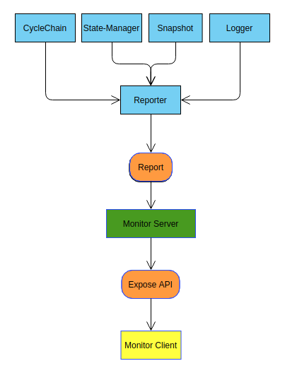

# Reporting

Active nodes in the Shardus network will reports various useful information about the Node and Network to a monitor server. Monitor server will process those data (report) received from the Nodes and expose an API. A front-end application (Monitor Client) will use this API to show the information in Graphical User Interface. Developers can easily view the status and information of Nodes, Transaction Statistics and Network related information using monitor client.

### Overview of Reporting System



### Consenser Nodes

All nodes will report to monitor server whenever there is a change in Node's status (joining, joined, active, removed). While a node is active and participating in the network, it will send these information to monitor server at a regular internal provided in the server configuration.

**Report Data Structure**

```ts
interface report {
  repairsStarted: number
  repairsFinished: number
  appState: string
  cycleMarker: string
  cycleCounter: number
  nodelistHash: string
  desiredNodes: number
  txInjected: number
  txApplied: number
  txRejected: number
  txExpired: number
  txProcessed: number
  reportInterval: number
  nodeIpInfo: IPInfo
  partitionReport: any
  globalSync: boolean
  partitions: number
  partitionsCovered: number
  currentLoad: number
  queueLength: any
  txTimeInQueue: number
  cycleRecord: CycleRecord
  missingPartitions: number[]
  logs: any
}
```

_Reporter.ts_ module is responsible for collecting and sending the data to monitor server. Reporter module will collect data from following modules to build the report.

- p2p/CycleChain
- State-Manager
- Snapshot
- Logger

## Monitor Server

The main function of monitor server is to validate, process and store the reports sent from Conseser Nodes. Monitor server expose `/api/report` endpoint to provide the summary of reports received from consenser nodes.

**Report**

```ts
export interface Report {
  nodes: NodeList
  totalInjected: number
  totalRejected: number
  totalExpired: number
  totalProcessed: number
  timestamp: number
}
```

Following sections represent the NodeList data structure exposed by monitor server.

**NodeList**

```ts
export interface NodeList {
  joining: {
    [key: string]: {} | JoinReport
  }
  syncing: {
    [key: string]: {} | SyncReport
  }
  active: {
    [key: string]: {} | ActiveReport
  }
}
```

**JoinReport**

```ts
export interface JoinReport {
  nodeIpInfo: NodeIpInfo
}
```

**SyncReport**

```ts
export interface SyncReport {
  publicKey: string
  nodeIpInfo: NodeIpInfo
}
```

**ActiveReport**

```ts
export interface ActiveReport {
  repairsStarted: number
  repairsFinished: number
  appState: string
  cycleMarker: string
  cycleCounter: number
  nodelistHash: string
  desiredNodes: number
  txInjected: number
  txApplied: number
  txRejected: number
  txExpired: number
  txProcessed: number
  reportInterval: number
  nodeIpInfo: NodeIpInfo
  partitionReport:
    | {}
    | {
        res: PartitionInfo[]
        cycleNumber: number
      }
  globalSync: boolean
  partitions: number
  partitionsCovered: number
  currentLoad: number
  queueLength: number
  txTimeInQueue: number
  cycleRecord: CycleRecord
  missingPartitions: number[]
  logs: any
  timestamp: number
}
```

**PartitionInfo**

```ts
export interface PartitionInfo {
  i: number
  h: string
}
```

**NodeIpInfo**

```ts
export interface NodeIpInfo {
  externalIp: string
  externalPort: number
  internalIp: string
  internalPort: number
}
```

## Monitor Client

Monitor client is a front-end application which shows the data (reports) from consensus nodes in an graphical form. Monitor client will query the report from monitor server via `/api/report` endpoint every 2 seconds. It will process and represent the nodes as grey, yellow, green, red circles, txs as small red dots and Network as big circle.
